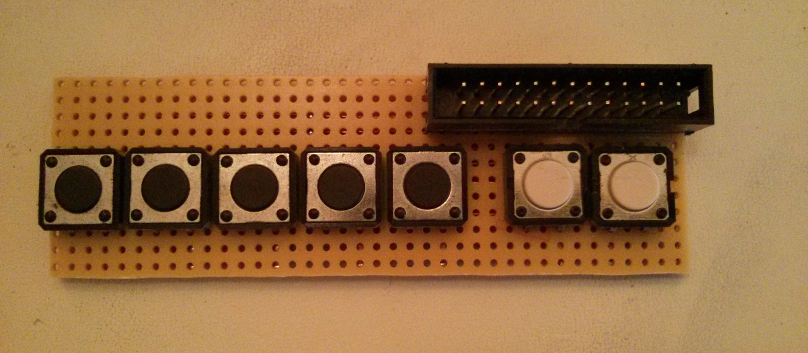
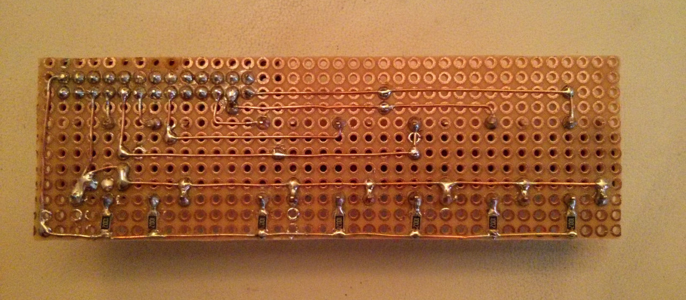
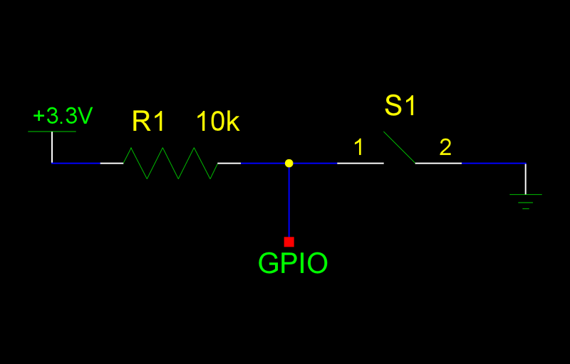
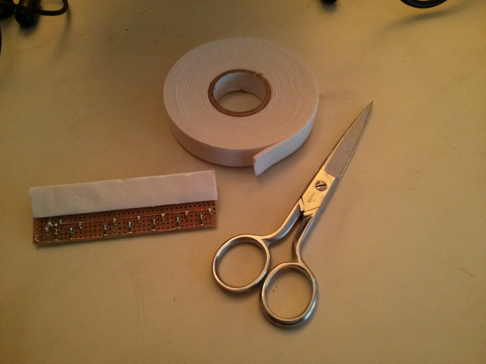
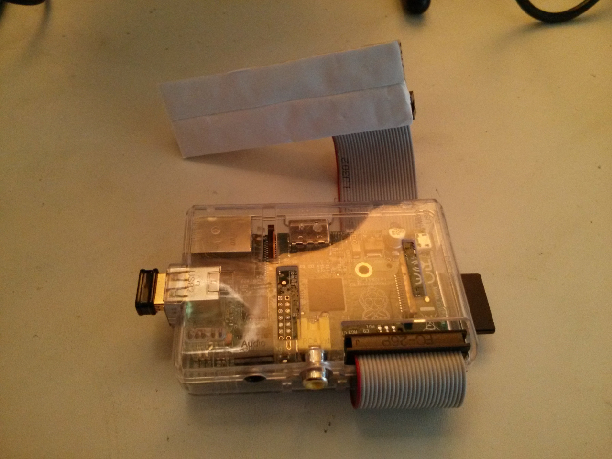
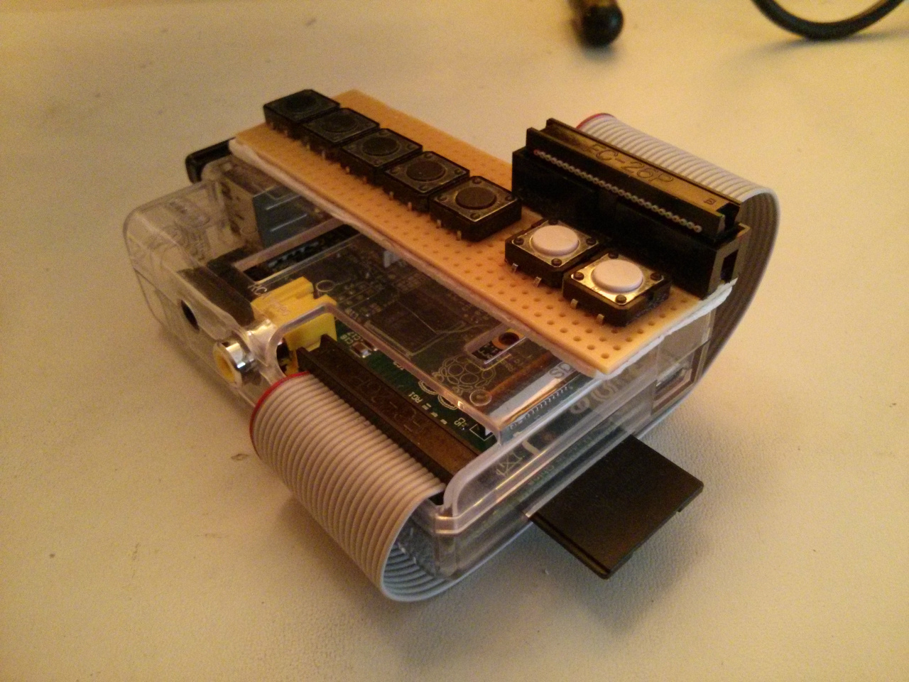

pidio
=====

Pidio is a Raspberry Pi based wifi radio player featuring a blind-friendly pushbutton user interface.  Below is the picture of the user interface.

To understand my thinking regarding this interface you have to know that I created this gadget for the grandmother of my girlfriend who is blind so I specifically designed the user interface to be blind-friendly.  That's why I used a small number of tactile buttons with simple functionality.

Pushbutton feature matrix:

| button           | short press      | long press (at least 2 seconds)  |
|------------------|------------------|----------------------------------|
| button 1 (black) | load preset 1    | save current station as preset 1 |
| button 2 (black) | load preset 2    | save current station as preset 2 |
| button 3 (black) | load preset 3    | save current station as preset 3 |
| button 4 (black) | load preset 4    | save current station as preset 4 |
| button 5 (black) | load preset 5    | save current station as preset 5 |
| button 6 (white) | previous station | n/a                              |
| button 7 (white) | next station     | stop / resume playback           |

I originally wanted to enable the user to shut down / power up the Pi but considering that the boot time is 93 seconds it would have provided a bad user experience.  Also, the Pi only consumes 3W idle, and 3.4W when streaming.  The stop / resume playback button is still useful to conserve bandwidth.

Building the hardware
---------------------

You've already seen the pushbutton user interface.  This is the back side:

This circuit is really nothing more than 7 switch circuits (image is courtesy of Adafruit Industries) wired to a protoboard:

I used double sided foam tape to fixate the panel:

Almost assembled unit:

Fully assembled unit:

You can only partially see the Edimax EW-7811UN USB wifi dongle that is understandably a critical piece of this wifi radio.

Software
--------

I started out from a [somewhat related project of Adafruit Industries](http://learn.adafruit.com/playing-sounds-and-using-buttons-with-raspberry-pi/code).  The resulting [code](pidio.py) seems solid despite of the ugly workarounds that I had to use because of the supremely unstable `mpd`.

First `apt-get install python-dev python-rpi.gpio mpd mpc`.  After trying to start up `pidio.py` from a custom-written init script which failed over and over for some reason I simply included `/root/pidio/pidio.py &` into `/etc/rc.local` which did the trick.

Retrieving Hungarian radio stations
-----------------------------------

1. I was looking for Hungarian radio stations.  Found and visited http://www.listenlive.eu/hungary.html
2. Utilizing the [$x](http://getfirebug.com/wiki/index.php/$x) construct I typed the following into the JavaScript console of Chrome:
`stations = $x('//table[@id="thetable3"]/tbody/tr/td[4]/a/@href');`
`for (i=0; i<results.length; i++) console.log(results[i].value);`
3. Copy-pasted the output into [hungarian-stations-all.m3u](stations/hungarian-stations-all.m3u)
4. Ditched all the invalid stations and created [hungarian-stations-filtered.m3u](stations/hungarian-stations-filtered.m3u)
